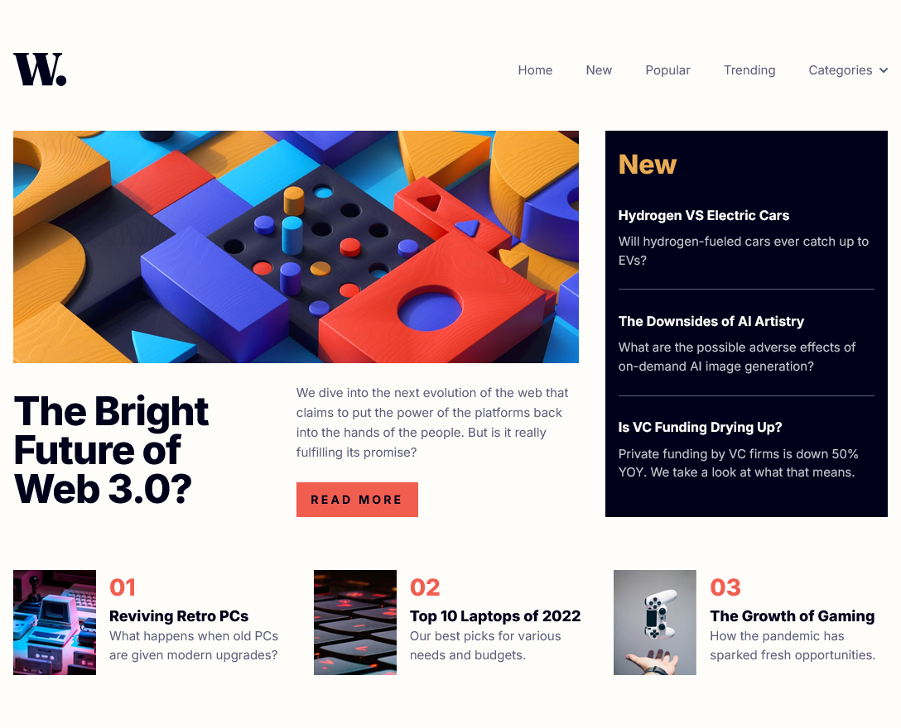

# Frontend Mentor - News Homepage Solution

This is a solution to the News Homepage challenge on Frontend Mentor. Frontend Mentor challenges help you improve your coding skills by building realistic projects.

## Table of contents

- [Overview](#overview)
  - [The challenge](#the-challenge)
  - [Screenshot](#screenshot)
  - [Links](#links)
- [My process](#my-process)
  - [Built with](#built-with)
  - [What I learned](#what-i-learned)
- [Author](#author)

## Overview

### The challenge

Users should be able to:

- View the optimal layout for the interface depending on their device's screen size
- See hover and focus states for all interactive elements on the page
- Toggle the mobile navigation menu drawer open and closed seamlessly

### Screenshot



### Links

- [Solution](https://github.com/Kking927/news-homepage)
- [Live Site](https://kking927.github.io/news-homepage/)

## My process

### Built with

- Semantic HTML5 markup
- CSS Custom Properties
- Flexbox and CSS Grid
- Mobile-first workflow
- Vanilla JavaScript

### What I learned

During this project, I gained more practice managing accessible responsive components by coordinating JavaScript states with CSS. For example, I implemented ARIA handling on the navigation toggle button to communicate open/closed panel states to screen readers:

```html
<button type="button" class="nav-toggle" aria-label="Open navigation menu" aria-expanded="false" aria-controls="primary-nav">
  
</button>
```
```js
navToggle.addEventListener("click", () => {
  const isOpen = navMenu.classList.toggle("is-open");

  // Dynamically syncing accessibility states with UI interactions
  navToggle.setAttribute("aria-expanded", isOpen);
  navToggle.setAttribute(
    "aria-label",
    isOpen ? "Close navigation menu" : "Open navigation menu"
  );
  toggleImg.src = isOpen ? closeIcon : menuIcon;
});
```

## Author

- Frontend Mentor - [@Kking927](https://www.frontendmentor.io/profile/Kking927)
